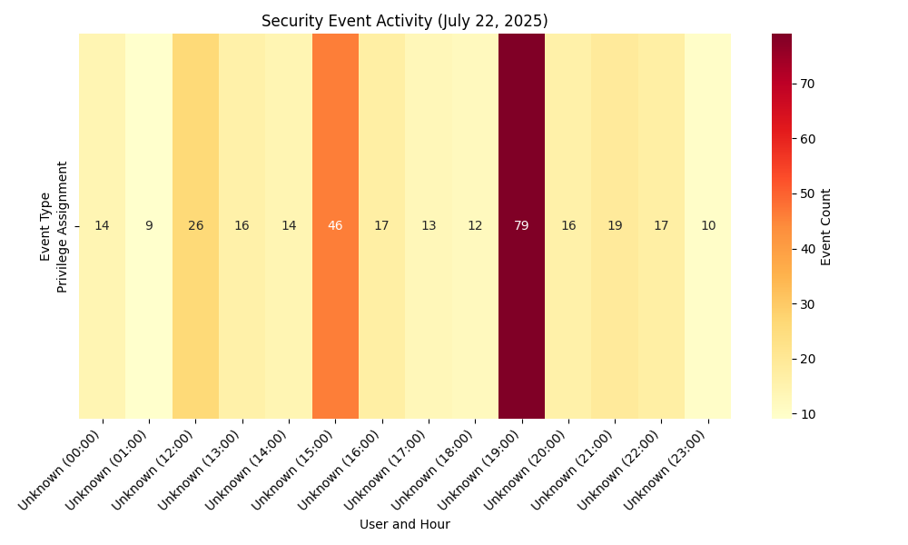

# Security Event Analysis — 2025-07-22

Analyzed Windows Security Event Logs to detect and visualize security events, demonstrating log analysis and automation skills for SOC Analyst roles.

## Event Summary
- **Privilege Assignment (Event ID 4672)**:
  - Unknown (23:00): 10 occurrences
  - Unknown (22:00): 17 occurrences
  - Unknown (21:00): 19 occurrences
  - Unknown (20:00): 16 occurrences
  - Unknown (19:00): 79 occurrences
  - Unknown (18:00): 12 occurrences
  - Unknown (17:00): 13 occurrences
  - Unknown (16:00): 17 occurrences
  - Unknown (15:00): 46 occurrences
  - Unknown (14:00): 14 occurrences
  - Unknown (13:00): 16 occurrences
  - Unknown (12:00): 26 occurrences
  - Unknown (01:00): 9 occurrences
  - Unknown (00:00): 14 occurrences

## Visualization

